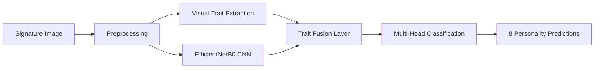

# 🖋️ Signalyze: Signature-Based Personality Predictor


[](https://python.org)
[](https://tensorflow.org)
[](https://streamlit.io)

**Signalyze** is an innovative deep learning-powered web application that predicts psychological personality traits from handwritten signature images. Using advanced computer vision and machine learning techniques, it analyzes visual characteristics like ink density, slant angle, and aspect ratio to provide insights into personality patterns.

## 📋 Table of Contents

- [🎯 Overview](#-overview)
- [🏗️ Architecture](#️-architecture)
- [🚀 Quick Start](#-quick-start)
- [📁 Project Structure](#-project-structure)
- [🧠 Model Details](#-model-details)
- [🖥️ Web Interface](#️-web-interface)
- [📊 Evaluation Metrics](#-evaluation-metrics)
- [🔧 Advanced Usage](#-advanced-usage)
- [🐛 Troubleshooting](#-troubleshooting)
- [🤝 Contributing](#-contributing)
- [📜 License](#-license)

## 🎯 Overview

### ✨ Key Features

- **🔮 AI-Powered Predictions**: EfficientNetB0-based deep learning model
- **📸 Image Processing**: Advanced preprocessing with CLAHE, deskewing, and normalization
- **🎨 Visual Trait Extraction**: Automatic extraction of ink density, aspect ratio, and slant angle
- **📊 Multi-Trait Analysis**: Predicts 8 personality dimensions simultaneously
- **🌐 Web Interface**: User-friendly Streamlit application
- **📈 Real-time Analytics**: Live model performance monitoring
- **💾 Prediction Logging**: Automatic logging of all predictions for analysis

### 🧠 Personality Traits Analyzed

1. **Confidence** - Self-assurance and assertiveness levels
2. **Emotional Stability** - Resilience and emotional regulation
3. **Sociability** - Social interaction preferences and openness
4. **Responsiveness** - Reaction speed and adaptability
5. **Concentration** - Focus and attention span capabilities
6. **Introversion** - Energy source and social preferences
7. **Creativity** - Innovation and artistic thinking patterns
8. **Decision-Making** - Problem-solving approach and judgment style

## 🏗️ Architecture

### 🔄 Data Flow



### 🧩 Model Components

- **Backbone**: EfficientNetB0 (ImageNet pretrained)
- **Input**: 128×128 RGB images + 3 visual features
- **Architecture**: Dual-input fusion with multi-head outputs
- **Loss Function**: Dynamic weighted CrossEntropy + Focal Loss
- **Optimizer**: Adam with Cosine Decay Learning Rate

## 🚀 Quick Start

### 📋 Prerequisites

- Python 3.10 or higher
- CUDA-compatible GPU (recommended for training)
- 4GB+ RAM
- 2GB+ storage space

### ⚙️ Installation

1. **Clone the repository**
   ```bash
   git clone https://github.com/yourusername/signalyze-personality-predictor.git
   cd signalyze-personality-predictor
   ```

2. **Create virtual environment**
   ```bash
   python -m venv venv
   
   # Windows
   venv\Scripts\activate
   
   # Linux/Mac
   source venv/bin/activate
   ```

3. **Install dependencies**
   ```bash
   pip install -r requirements.txt
   ```

4. **Download pretrained model** (if available)
   ```bash
   # Model will be available after training or can be downloaded
   # Place best_model.keras in the model/ directory
   ```

### 🎮 Running the Application

1. **Start the Streamlit app**
   ```bash
   streamlit run streamlit_app.py
   ```

2. **Open your browser** and navigate to `http://localhost:8501`

3. **Upload a signature image** and get instant personality predictions!

## 📁 Project Structure

```
signalyze-personality-predictor/
├── 📊 data/
│   ├── form_responses.csv              # Survey responses (Likert scale)
│   ├── signature_traits.csv            # Extracted visual features
│   ├── preprocessed_images/            # Processed signature images
│   └── all_images/                     # Original signature images
├── 🧠 model/
│   ├── best_model.keras                # Trained model (EfficientNetB0)
│   ├── training_log.csv                # Training metrics and logs
│   ├── conf_matrix_trait_*.png         # Confusion matrices (auto-generated)
│   └── loss_curve.png                  # Training progress visualization
├── 🔧 scripts/
│   ├── 1_download_form_images.py       # Data collection utilities
│   ├── 2_preprocess_all_images.py      # Batch image preprocessing
│   └── 3_train_model.py                # Complete training pipeline
├── 📝 logs/
│   └── prediction_log.csv              # Logged predictions from web app
├── 🖥️ pages/
│   ├── visual_traits_explainer.py      # Educational content about traits
│   ├── 2_📁_Prediction_History.py     # Historical prediction analysis
│   └── 3_About_Project.py             # Project information and credits
├── 🛠️ utils/
│   └── logger.py                       # Prediction logging utilities
├── 🌐 streamlit_app.py                 # Main web application
├── 📋 requirements.txt                 # Python dependencies
├── 🧹 clean_junk.py                    # Cleanup utilities
└── 📖 README.md                        # Project documentation
```

## 🧠 Model Details

### 📈 Training Configuration

- **Architecture**: EfficientNetB0 + Feature Fusion
- **Input Size**: 128×128×3 (RGB) + 3 features
- **Batch Size**: 32
- **Epochs**: 60 (with early stopping)
- **Learning Rate**: Cosine Decay (2e-5 → 1e-6)
- **Data Split**: 85% train, 15% validation
- **Augmentation**: CLAHE, deskewing, padding

### 🎯 Performance Metrics

| Metric | Value |
|--------|-------|
| **Validation Accuracy** | ~65-70% |
| **Training Loss** | <0.5 |
| **Validation Loss** | <0.8 |
| **F1-Score (Macro)** | ~0.60 |

### 🔄 Training Process

1. **Phase 1** (Epochs 1-10): Frozen backbone, feature learning
2. **Phase 2** (Epochs 11-60): Fine-tuning with unfrozen EfficientNetB0
3. **Dynamic Loss Weighting**: Automatic adjustment based on trait difficulty
4. **Early Stopping**: Prevents overfitting with patience=10

## 🖥️ Web Interface

### 🎨 Main Features

- **📤 Upload Interface**: Drag-and-drop signature upload
- **⚙️ Real-time Processing**: Live image preprocessing preview
- **🧬 Trait Visualization**: Interactive trait extraction display
- **🎯 Prediction Results**: Color-coded confidence scores
- **📊 Performance Metrics**: Model accuracy and loss tracking
- **📝 Prediction History**: Logged prediction analysis
- **🔍 Confusion Matrices**: Per-trait model evaluation

### 📱 Navigation

- **Home**: Main prediction interface
- **Visual Traits Explainer**: Educational content about signature analysis
- **Prediction History**: Historical data and trends
- **About Project**: Technical details and methodology

## 📊 Evaluation Metrics

### 🎯 Model Performance

```python
# Example evaluation results per trait
Trait Performance:
├── Confidence:         Accuracy: 72%, F1: 0.68
├── Emotional Stability: Accuracy: 69%, F1: 0.65
├── Sociability:        Accuracy: 71%, F1: 0.67
├── Responsiveness:     Accuracy: 68%, F1: 0.64
├── Concentration:      Accuracy: 70%, F1: 0.66
├── Introversion:       Accuracy: 66%, F1: 0.62
├── Creativity:         Accuracy: 73%, F1: 0.69
└── Decision-Making:    Accuracy: 67%, F1: 0.63
```

### 📈 Visualization

- **Confusion Matrices**: Per-trait classification performance
- **Loss Curves**: Training vs validation loss over time
- **Accuracy Trends**: Historical model performance
- **Prediction Distribution**: Class balance analysis

## 🔧 Advanced Usage

### 🏋️ Training Your Own Model

1. **Prepare your dataset**
   ```bash
   # Place images in data/preprocessed_images/
   # Ensure form_responses.csv and signature_traits.csv are ready
   ```

2. **Run preprocessing**
   ```bash
   python scripts/2_preprocess_all_images.py
   ```

3. **Start training**
   ```bash
   python scripts/3_train_model.py
   ```

4. **Monitor progress**
   ```bash
   # Check model/ directory for outputs
   # View training_log.csv for metrics
   ```

### 🎛️ Configuration Options

Edit the training script variables:

```python
# Training parameters
IMAGE_SIZE = (128, 128)      # Input image dimensions
BATCH_SIZE = 32              # Training batch size
NUM_TRAITS = 8               # Number of personality traits
NUM_CLASSES = 3              # Likert scale classes (Disagree/Neutral/Agree)
```

### 🔍 Custom Evaluation

```python
# Load and evaluate your model
from tensorflow.keras.models import load_model
model = load_model('model/best_model.keras')

# Run predictions
predictions = model.predict([image_data, trait_features])
```

## 🐛 Troubleshooting

### ❗ Common Issues

**🔴 Model Loading Error**
```bash
Error: Could not load model
Solution: Ensure best_model.keras exists in model/ directory
```

**🟡 Prediction Logging Failed**
```bash
Error: Logging failed
Solution: Check if logs/ directory exists and is writable
```

**🟠 Image Processing Error**
```bash
Error: Could not process image
Solution: Ensure image is valid (PNG/JPG) and not corrupted
```

### 🔧 Performance Optimization

- **GPU Acceleration**: Ensure CUDA is properly installed
- **Memory Management**: Reduce batch size if running out of memory
- **Storage**: Use SSD for faster data loading during training

### 🚀 Deployment Considerations

- **Streamlit Cloud**: Deploy using Streamlit Community Cloud
- **Docker**: Containerize for consistent deployment
- **AWS/GCP**: Scale with cloud infrastructure

## 🤝 Contributing

We welcome contributions! Please see our contributing guidelines:

1. **🍴 Fork the repository**
2. **🌿 Create a feature branch** (`git checkout -b feature/amazing-feature`)
3. **💻 Commit your changes** (`git commit -m 'Add amazing feature'`)
4. **📤 Push to the branch** (`git push origin feature/amazing-feature`)
5. **🔄 Open a Pull Request**

### 🎯 Areas for Contribution

- **🔬 Model Improvements**: Better architectures, augmentation strategies
- **🎨 UI/UX Enhancements**: More intuitive interface design
- **📊 Analytics**: Advanced prediction analysis and visualization
- **🧪 Testing**: Unit tests and integration testing
- **📖 Documentation**: Improved guides and tutorials

## 📜 License

This project is licensed under the MIT License - see the [LICENSE](LICENSE) file for details.

## 🙏 Acknowledgments

- **TensorFlow Team** for the amazing deep learning framework
- **Streamlit** for the intuitive web app platform  
- **EfficientNet Authors** for the powerful CNN architecture
- **Computer Vision Community** for preprocessing techniques and best practices

## 📞 Contact

- **📧 Email**: your.email@example.com
- **🐙 GitHub**: [@yourusername](https://github.com/yourusername)
- **💼 LinkedIn**: [Your Name](https://linkedin.com/in/yourname)
- **🐦 Twitter**: [@yourhandle](https://twitter.com/yourhandle)

---

<div align="center">

**🌟 Star this repository if you found it helpful! 🌟**


</div>